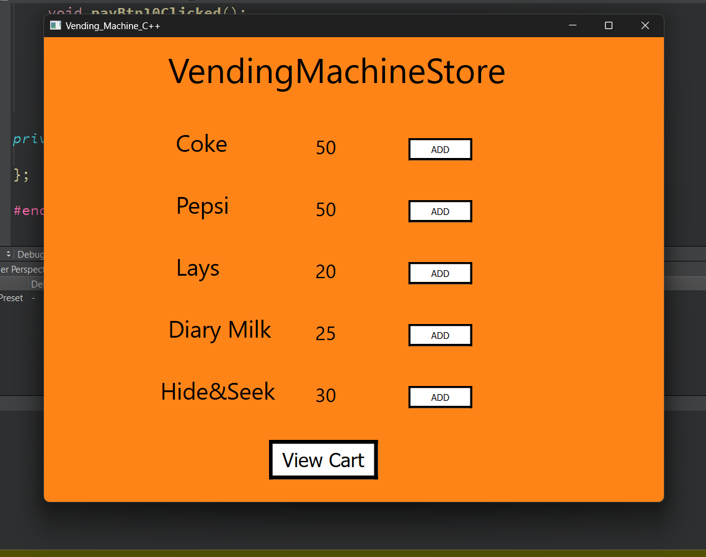
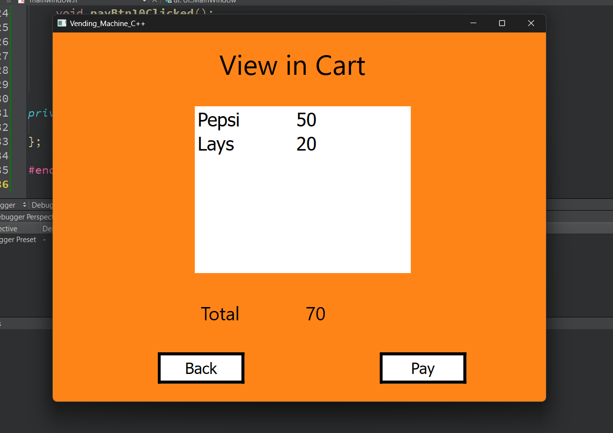
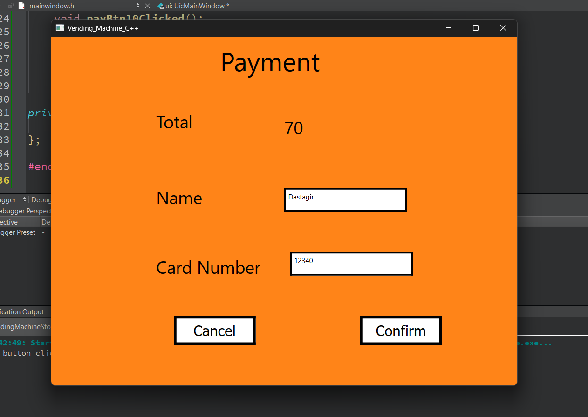
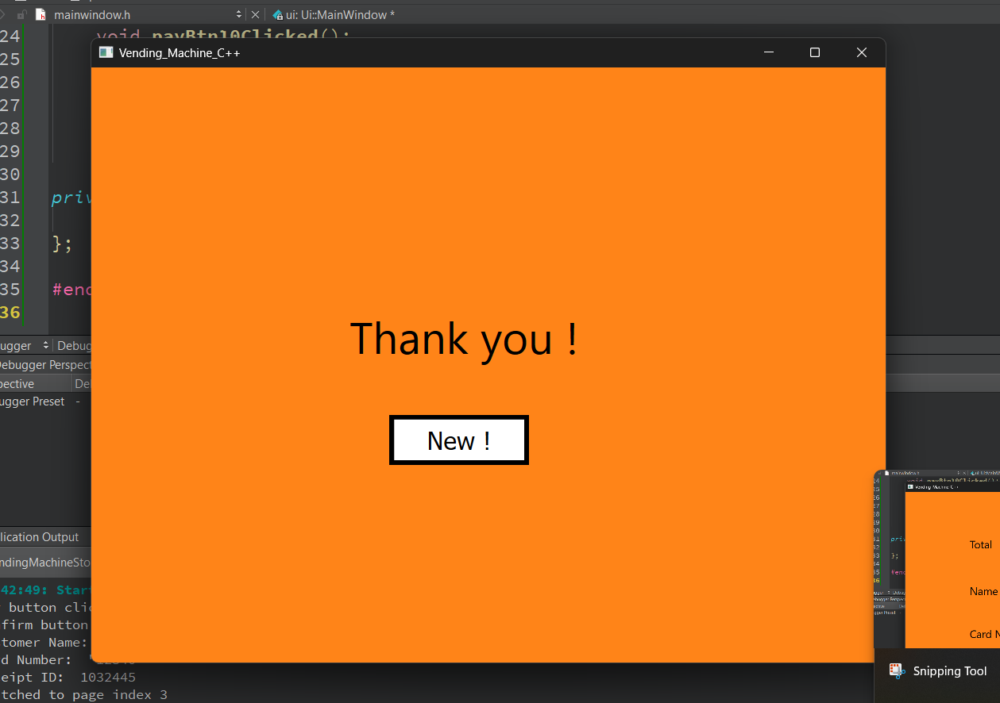

# Vending Machine

A desktop vending machine application where users can add items to their cart, view the cart, and make a payment. After a successful payment, the user can start a new transaction.

## Features

- Add items to the cart.
- View items in the cart.
- Make a payment.
- Start a new transaction after a successful payment.

## Screenshots






## Why Qt?

Qt is a powerful and versatile framework for developing cross-platform applications. Here are a few reasons why Qt was chosen for this project:

- **Cross-Platform Compatibility**: Qt allows the application to run on multiple operating systems, including Windows, macOS, and Linux, without changing the source code.
- **Rich UI Capabilities**: Qt provides a wide range of tools and widgets for creating sophisticated and responsive user interfaces.
- **Strong Community and Support**: Qt has a large and active community, along with extensive documentation and support resources.
- **Modular Architecture**: Qt's modular approach allows developers to include only the necessary components, optimizing performance and reducing application size.
- **Ease of Use**: Qt’s comprehensive IDE, Qt Creator, provides a user-friendly environment for designing, coding, and debugging applications.

## Getting Started

### Prerequisites

- Qt 6.7.2 or later
- C++ compiler

### Installation

1. Clone the repository:
   ```bash
   git clone https://github.com/yourusername/vendingmachine.git
